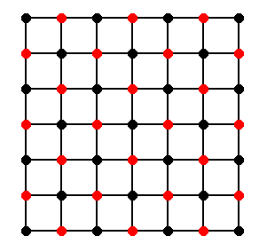

# Example 1: Tutorial

This example should serve as a tutorial of the aLFA framework. We analyze several components of a two-grid method to solve the linear system of equations $Ax=b$, where $A$ corresponds to the two-dimensional Laplacian discretized on an equidistant rectangular lattice.

This example is structured as follows.
1. We define the underyling linear operator: The second order approximation of the two-dimensional Laplacian $L$ obtained via finite central differences (5-point stencil). We further compute its spectrum.
2. We show the connection of the operator $L$ to the system matrix $A$.
3. We introduce and analyze the Jacobi-method.
4. We define the coarse grid correction.
5. We analyze the two-grid method using the Jacobi-method as a smoother.
6. We introduce the lexicographic Gauss-Seidel and red-black Gauss-Seidel smoother and analyze the corresponding two-grid method.
7. We use this framework to prototype an actual two-grid method.

### Importing required packages
```@example tutorial; continued = true
using alfa
using LinearAlgebra
using Plots
```


## The discretized Laplacian $L$ in 2D  
We are going to define the 2D discretized Laplacian $L:\mathcal{L}(\mathbb{L}^s(\mathcal{A})) \rightarrow \mathcal{L}(\mathbb{L}^s(\mathcal{A}))$ on an equidistant rectangular lattice. Thus, $\mathbb{L}^s(\mathcal{A})$ describes the underlying structure of the domain and codomain of the operator $L$.

### Definition of the underlying lattice structure
First, we need to define a basis of the underlying translational-invariance: an equidistant rectangular lattice is given by
```math
\mathcal{A} = \frac{1}{h}\left[\begin{matrix} 1 & 0 \\ 0 & 1 \end{matrix}\right] = \left[\begin{matrix} \mathcal{a}_1 & \mathcal{a}_2\end{matrix}\right].
```
The lattice generated by $\mathcal{A}$ is the set
```math
\mathbb{L}(\mathcal{A}) = \mathcal{A}\mathbb{Z}^2 = \{x = \alpha_1\mathcal{a}_1 + \alpha_2\mathcal{a}_2 \ : \ \alpha_1,\alpha_2 \in \mathbb{Z}\}
```

The class alfa.Lattice corresponds to $\mathbb{L}(\mathcal{A})$ and is initialized with the matrix $\mathcal{A}$.

```@example tutorial
h = .1  # define h
A = h*[1 0; 0 1]  # 2x2 identity matrix scaled with h

# initialize the lattice;
#In the constructor we need to specify the size/dimensionality (N=2)
# and the datatype of the lattice basis (T=Float64)
#  (the alternative to Float is Rational{BigInt})
LA = alfa.Lattice{2,Float64}(A)  

```
We can plot a section of the lattice. Black arrows correspond to the primitive vectors $a_1$ and $a_2$
```@example tutorial
plot(LA)
```

### Definition of the domain and codomain of the operator $L$
The structure element $s$ of $\mathbb{L}^s(\mathcal{A})$ corresponds of the location of the unknowns. We can simply choose $s=(s_1)$, where $s_1=(0,0)$, such that the crystal points coincide with the lattice structure.

The struct alfa.Crystal is used to represent both crystals corresponding to the domain and codomain of an operator. We initialize it with `alfa.Crystal{N,T}(LA,s_domain, s_codomain)`, where s_domain corresponds to the structure element of the domain, and s_codomain corresponds to the structure element of the codomain. (In our case we have s_domain = s_codomain = $s$):

```@example tutorial
Domain = [[0,0]]
Codomain = [[0,0]]
CA = alfa.Crystal{2,Float64}(LA,Domain,Codomain)
```
We can have a plot function to plot a section of a crystal:

```@example tutorial
plot(CA)
```

### Initializing the operator $L$

As we have defined the underlying domain and codomain of our operator, we can initialize the multiplication operator $L$.

This class represents a multiplication operator corresponding to
```math
(Lf)(x) = \sum_{y \in \mathbb{Z}^\text{d}  } m_L^{y} \cdot f(x+\mathcal{A}y),
```
for all $x \in \mathbb{L}(\mathcal{A})$, where $d=2$ is the dimensionality. Note, that the position of the operator is given in fractional coordinates, not in cartesian coordinates $\mathcal{A}y$, such that $y$ is always integral.

```@example tutorial
L = alfa.CrystalOperator{2,Float64}(CA)
```

### Adding the multipliers of $L$
We use `push!(L,m)` to add multipliers $m_L^{y}$ to the operator in order to define the discretized Laplacian. As the structure elements of the domain and codomain are both $1$-dimensional, the matrices m_L^{y} are of size $1\times 1$.

The multipliers are then saved within a SortedSet L.m which is lexicographically ordered with respect to the position y.

```@example tutorial
push!(L, alfa.Multiplier([0 0], [-4/h^2]))
push!(L, alfa.Multiplier([0 -1], [1/h^2]))
push!(L, alfa.Multiplier([0 1], [1/h^2]))
push!(L, alfa.Multiplier([1 0], [1/h^2]))
push!(L, alfa.Multiplier([-1 0], [1/h^2]))

@show L
```

A schematic representation can be created with the plot command.

```@example tutorial
plot(L)
```

## Computing the spectrum of $L$

The spectrum of a CrystalOperator is computed via the ``alfa.symbol(L::CrystalOperator,k::Vector)`` method, where ``k`` is the frequency/wavevector.

```@example tutorial
alfa.symbol(L,[0, 0])
```


In order to compute or approximate the "complete" spectrum, we divide $[0,1)^\text{d}$ into $N^d$ equidistant points to get a discretization of the primitive cell of the dual lattice $\mathcal{A}^{-T}[0,1)^\text{d}$. Next, we compute the eigenvalues for each `symbol(L,k)`, where k is sampled on these $N^d$ points.

```@example tutorial
alfa.eigvals(L,N=10)
```

We may also save everything in a dataframe via `alfa.eigvals_df(L,N=N)` or directly produce a plot of the absolut part of the spectrum as follows
```@example tutorial
surfacespectrum(L,N=20)
```

## Obtaining a system matrix $A$ from a multiplication operator $L$

We can obtain the system matrix $A$ corresponding to the a discretization of the Laplacian on the unit square [0,1]^2 with periodic boundary conditions in two steps.

### Step 1
We rewrite $L$ with respect to the sublattice $\mathbb{L}(\mathcal{Z}) \subset \mathbb{L}(\mathcal{A})$ with $\mathcal{Z}=\left(\begin{matrix} 1 & 0 \\ 0 & 1 \end{matrix}\right)$.

Due to the fact that we find $1/h^2 = 100$ lattice points in $Z[0,1)^2 \cap \mathbb{L}(\mathcal{A}) =: \tilde{s}$, we obtain an operator
```math
\tilde{A}:\mathcal{L}(\mathbb{L}^{\tilde{s}}(\mathcal{Z})) \rightarrow \mathcal{L}(\mathbb{L}^{\tilde{s}}(\mathcal{A})) \text{ with } (\tilde{A} g)(x) =  \sum_{y \in \mathbb{Z}^\text{d}  } m_{\tilde{A}}^{y} \cdot g(x+\mathcal{Z}y), \quad m_{\tilde{A}} \in \mathbb{C}^{100\times 100}
```
```@example tutorial
using SparseArrays
tA = alfa.wrtLattice(L,alfa.Lattice{2,Float64}([1 0; 0 1]))
tA = alfa.normalize(tA); # make sure all points of the structure elements are within [0,1)^2 and lexicographically ordered.
nothing # hide
```

We create a spy plot of all five multipliers of tA. One multiplier corresponds to the interaction of the unknowns within the unit cell. The other four multipliers correspond to the connections beyond the boundaries:

```@example tutorial
using SparseArrays
parr = []
for x in tA.M
    p = spy(SparseMatrixCSC(x.mat), c=:blues, title="position: " * string(x.pos))
    push!(parr, p)
end
plot(parr...);
```

### Step two
As we impose periodic boundary conditions on the unit square, all lattice points of $\mathbb{L}(Z)$ are identified. Thus, we obtain the system matrix $A$ by adding all multipliers of tA.


```@example tutorial
tAm = sum(x.mat for x in tA.M);
spy(SparseMatrixCSC(tAm), c=:blues);
```


## A link between the the eigenvalues of $A$ and $L_k$

We can compute the eigenvalues and eigenvectors of $A$ and compare them with the eigenvalues computed via LFA:

```@example tutorial
eig1 = abs.(sort(eigvals(tAm), by=abs))
eig2 = abs.(alfa.eigvals(L,N=10, by=abs))

p = plot(eig1, label="eigenvalues of the system matrix")
plot!(eig2, label="eigenvalues computed via the symbol")
plot!(abs.(eig1.-eig2), label="pairwise difference of the eigenvalues.")

```
The eigenvalues are equal as long as N=1/h, where $h$ corresponds to the lattice spacing and $N$ corresponds to the discretization of the frequency space.

# Analysis of stationary iterative methods


Given a linear system of equations (LSE) $Ax=b$, the Jacobi method produces iterates via
```math
x_{k+1} \leftarrow (I-S^{-1}A)x_k + S^{-1}b,
```
where $I$ is the identity and $S$ is simply the diagonal of $A$.


Denote with $x^* = A^{-1}b$ the solution of the LSE and with $e_k = x^* - x_k$ the $k$th error. Since
```math
e_{k+1} = (I-S^{-1}A)e_k
```
the operator $G:=(I-S^{-1}A)$ is called error propagator. We are interested in the spectral radius $\rho(G)=\max\{|\lambda |  \ : \ \lambda \text{ Eigenvalue of }G \}$  of the error propagator, as we have
```math
||e_{k+1}|| \approx \rho(G) ||e_{k}||
```
 for large k (if the initial error has a component in the direction of the eigenvector corresponding to the largest absolute eigenvalue).


## The Jacobi method

#### Definition of the Jacobi-method

We compute the spectrum via LFA, thus we need to define $I$ and $S$ as multiplication operators.
In case of the Jacobi method, the multipliers of
```math
S:\mathcal{L}(\mathbb{L}^s(\mathcal{A})) \rightarrow \mathcal{L}(\mathbb{L}^s(\mathcal{A})), \quad\quad \quad (Sf)(x) = \sum_{y \in \mathbb{Z}^\text{d}  } m_S^{y} \cdot f(x+\mathcal{A}y),
```
are given by
```math
m_S^{y} = \begin{cases} m_L^{y}  & \text{ if } y = 0 \\ 0 & \text{ else.} \end{cases}
```

```@example tutorial
S_jac = alfa.CrystalOperatorCopyWithMultipliers(L)

plot(S_jac)
```

### Analysis of the Jacobi-method

We analyze the error propagator of the Jacobi method using underrelaxation of .8.

```@example tutorial
f_jac =:(I-0.8*inv($S_jac)*$L) # construct an expression holding the CrystalOperators S and L.
oc = alfa.OperatorComposition(f_jac)

surfacespectrum(oc, 40) # plot the absolute part of the spectrum using 40^2 points.
```

### Definition of the two-grid error propagator

We are going to analyze the two-grid method corresponding to the error propagator
$KG_1 = (I-P L_c^{-1} RL)\cdot G_1$ with $R=P^T$, $L_c = RLP$. Thus, we only have to define the prolongation operator $P$ explicitly. This operator maps from a coarse crystal to the fine crystal $\mathbb{L}^s(\mathcal{A})$.

We use the following coarse grid: $\mathbb{L}^{t}(2\mathcal{A})$, $t=(0,0)$:

```@example tutorial
plot(alfa.Lattice{2,Float64}(2*L.C.A))
```

The so-called 'full weighting' prolongation operator $P$ has a translational invariance of $2\mathcal{A}$. Thus we can define it within this framework as
$$P : \mathcal{L}(\mathbb{L}^t(2\mathcal{A})) \rightarrow \mathcal{L}(\mathbb{L}^{\hat{s}}(2\mathcal{A})),$$

where the codomain $\mathbb{L}^{\hat{s}}(2\mathcal{A})$ is a representation of the fine crystal $\mathbb{L}^{s}(\mathcal{A})$, but with respect to the larger translational invariance. This is the case if the structure element consists of all lattice points $\mathbb{L}(\mathcal{A})$ found in the primitive cell $2\mathcal{A}[0,1)^2$:  $$\hat{s} = \mathbb{L}^s(\mathcal{A}) \cap 2\mathcal{A}[0,1)^2 =  ( s, s + \mathcal{a}_1, s + \mathcal{a}_2, s + \mathcal{a}_1 + \mathcal{a}_2) = ( 0,  \mathcal{a}_1,  \mathcal{a}_2,  \mathcal{a}_1 + \mathcal{a}_2).$$

```@example tutorial
p_domain = [[0, 0]]  # corresponds to "t" in the above description
# corresponds to \hat{s} in the above description
p_codomain = [A*[0, 0], A*[0, 1], A*[1, 0], A*[1, 1]]


Ccoarse = alfa.Crystal{2,Float64}(2*L.C.A, p_domain, p_codomain)

# a plot of the domain and codomain.
plot(Ccoarse)
```

We initialize and define the prolongation operator $P$. This operator maps a value of each coarse grid point to its $9$ nearest fine-grid points:

```@example tutorial
P = alfa.CrystalOperator{2,Float64}(Ccoarse)
push!(P, alfa.Multiplier([0,0], [1; 1/2; 1/2; 1/4]))
push!(P, alfa.Multiplier([1,0], [0;   0; 1/2; 1/4]))
push!(P, alfa.Multiplier([0,1], [0; 1/2;   0; 1/4]))
push!(P, alfa.Multiplier([1,1], [0;   0;   0; 1/4]))

plot(P)
```

We can compute the restriction operator $R=P^T$ and the coarse grid operator $L_c = RLP$.

```@example tutorial
R = transpose(P)
Lc = R*L*P
plot(plot(R), plot(Lc))
```

### Two-grid analysis with Jacobi smoothing:

As all operators share the translational invariance of $\mathbb{L}(2\mathcal{A})$ each operator can be rewritten with respect to this translational invariance. Alltogether, the error propagator is a mapping
```math
KG_1 : \mathcal{L}(\mathbb{L}^{\hat{s}}(2\mathcal{A})) \rightarrow \mathcal{L}(\mathbb{L}^{\hat{s}}(2\mathcal{A})).
```
As the structure element is of size $4$ ( $\hat{s} = ( 0,  \mathcal{a}_1,  \mathcal{a}_2,  \mathcal{a}_1 + \mathcal{a}_2)$), its symbol ${(KG_1)}_k$ is of size $4\times 4$ and we obtain $4$ eigenvalues per wavevector $k$.


```@example tutorial
f_cgc = :(I-$P*inv($Lc)*$R*$L)
f_tgj = f_cgc*f_jac
oc_tgj = alfa.OperatorComposition(f_tgj)
alfa.symbol(oc_tgj, [0,0])
```

A plot of the absolute part of the spectrum:
```@example tutorial
surfacespectrum(oc_tgj, N=20, zfilter=(0,0.7))
```
Note, that the zfilter filters the eigenvalue corresponding to the constant eigenfunction  (``k=(0,0)``) which is in the kernel of ``L``.


The spectral radius of the two-grid error propagator is $.6$ when we use underrelaxation of $\omega = .8$ in the Jacobi-method. Thus, the norm of an error is reduced by $40\%$ in each iteration of the two-grid method.


## Lexicographic Gauss-Seidel smoothing

Given a linear system of equations (LSE) $Ax=b$, the Gauss-Seidel method produces iterates via
```math
x_{k+1} \leftarrow (I-S^{-1}A)x_k + S^{-1}b,
```
where $I$ is the identity and $S$ is simply the triangle of $A$.
We assume that the unknowns $x_1,x_2,\ldots,x_{1/h^2}$ are ordered lexicographically, i.e.,
```math
x_i=(x_{i_1}, x_{i_2}) < x_j=(x_{j_1}, x_{j_2}) \text{ iff } \left[(x_{i_1} < x_{j_1}) \text{ or } (x_{i_1} = x_{j_1} \text{ and }x_{i_2} < x_{j_2})\right].
```

In the lower triangle of $A$ we find the connections of each unknown $x_i$, which is not part of the boundary, to the unknowns $x_j$ with $x_i \leq x_j$. Thus, we can express this operator for all unknowns that do not lie at the boundary. We have  ``S:\mathcal{L}(\mathbb{L}^s(\mathcal{A})) \rightarrow \mathcal{L}(\mathbb{L}^s(\mathcal{A})),``


```math
(Sf)(x) = \sum_{y \in \mathbb{Z}^\text{d}} m_S^{y} \cdot f(x+\mathcal{A}y) \quad \text{ for all } x \text{ which do not lie near/at the boundary},
```

with nonzero multipliers
```math
m_S^{y} = \begin{cases} m_L^{y}  & \text{ if } y \leq 0 \\ 0 & \text{ else} \end{cases}
```


where $y \leq 0$ refers to the lexicographic ordering.

```@example tutorial
S = alfa.CrystalOperatorCopyLowerTriangle(L)

plot(S)
```

### Two-grid analysis with lexicographic Gauss-Seidel smoothing:

```@example tutorial
f_gs = :(I-$inv($S)*$L)
f_tggs = f_cgc*f_gs
oc_tggs = alfa.OperatorComposition(f_tggs)
surfacespectrum(oc_tggs, N=40, zfilter=(0,0.7))
```


## A colored smoother: red-black Gauss-Seidel

Instead of lexicographic Gauss-Seidel, we can update unknowns using a different ordering. Consider the following red-black coloring of the underlying structure:




Red-black Gauss-Seidel corresponds to the method which updates red unknowns before it updates black unknowns. This can be described with an error propagator of the form
$G_b \cdot G_r$ where $G_x=(I - R_x^T (R_x A R_x^{T})^{-1}R_x A)$, where $R_x$, $x=r,b$, is the canonical restriction to the red/black unknowns.

First, we describe the red-black crystal:
We have
```math
\mathbb{L}^u(C), C = \left(\begin{matrix} \mathcal{a}_1 + \mathcal{a}_2 & \mathcal{a}_1 - \mathcal{a}_2 \end{matrix}\right) = \mathcal{A}\left(\begin{matrix} 1 & 1 \\ 1 & -1\end{matrix}\right)
```
with $u=(0,\mathcal{a}_1)=:(u_\text{red} , u_\text{black})$.

```@example tutorial
C = A*[1 1; 1 -1]
u = [A*[0,0], A*[1,0]]
u_red = [u[1]]
u_black = [u[2]]
Cr = alfa.Crystal{2,Float64}(C, u, u_red)
Cb = alfa.Crystal{2,Float64}(C, u, u_black)

p1 = plot(Cr)
p2 = plot(Cb)
plot(p1, p2)
```

Definition of the restriction operators:

```@example tutorial

Rr = alfa.CrystalOperator{2,Float64}(Cr)
push!(Rr, alfa.Multiplier([0 0], [1 0]))
Rb = alfa.CrystalOperator{2,Float64}(Cb)
push!(Rb, alfa.Multiplier([0 0], [0 1]))

p1 = plot(Rr)
p2 = plot(Rb)
plot(p1, p2)
```

Defintion of the smoother:

```@example tutorial

Sr = Rr*L*Rr'
Sb = Rb*L*Rb'

p1 = plot(Sr)
p2 = plot(Sb)
plot(p1, p2)
```

### Twogrid analysis with red-black smoothing

```@example tutorial
fr = :(I-$Rr'*$inv($Sr)*$Rr*$L)
fb = :(I-$Rb'*$inv($Sb)*$Rb*$L)
f_tgrb = f_cgc*fb*fr
oc_tgrb = alfa.OperatorComposition(f_tgrb)
surfacespectrum(oc_tgrb, N=40, zfilter=(0,0.7))
```

### Alternative construction and analysis of red-black

A simpler construction can be done as follows. Note, that we (have to) use the pseudoinverse instead of the inverse as the constructed operators Sr and Sb are singular:
```@example tutorial
Lrb = alfa.wrtLattice(L, L.C.L.A*[1 1; 1 -1])
Sr = alfa.CrystalOperatorCopyWithMultipliers(Lrb, idx=[1])
Sb = alfa.CrystalOperatorCopyWithMultipliers(Lrb, idx=[2])
fr = :(I-pinv($Sr)*$L)
fb = :(I-pinv($Sb)*$L)
f_tgrb = f_cgc*fb*fr
oc_tgrb = alfa.OperatorComposition(f_tgrb)
surfacespectrum(oc_tgrb, N=40, zfilter=(0,0.7))
```


## Prototyping a two-grid method

By rewriting all operators with respect to a shared *large* translationally invariance $\mathcal{Z}$ analogously to "[Obtaining a system matrix $A$ from a multiplication operator $L$](#Obtaining-a-system-matrix-$A$-from-a-multiplication-operator-$L$)", we can prototype a two-grid method as follows. We stick to the Jacobi example.


```@example tutorial
wrtL = alfa.Lattice{2,Float64}([1 0; 0 1])
Lm = SparseMatrixCSC(alfa.construct_matrix(L,wrtL))
Rm = SparseMatrixCSC(alfa.construct_matrix(R,wrtL))
Pm = SparseMatrixCSC(alfa.construct_matrix(P,wrtL))
Sm = SparseMatrixCSC(alfa.construct_matrix(S_jac,wrtL))
Lcm = SparseMatrixCSC(alfa.construct_matrix(Lc,wrtL))

nothing # hide
```

We create a spy plot of all matrices:


```@example tutorial
pLm = spy(Lm, c=:blues, title="Lm");
pRm = spy(Rm, c=:blues, title="Rm");
pPm = spy(Pm, c=:blues, title="Pm");
pSm = spy(Sm, c=:blues, title="Sm");
pLcm = spy(Lcm, c=:blues, title="Lcm");
plot(pLm, pRm, pPm, pSm, pLcm);
```

## Definition of the application of the smoother and coarse grid correction

```@example tutorial
SmLU = lu(Sm)
LcmLU = lu(Lcm)

function smooth(b, x)
    r = b-Lm*x
    x += 0.8*(SmLU\r)
    return x
end

function cgc(b, x)
    r = b-Lm*x
    rc = Rm*r
    xc = LcmLU\rc
    x += Pm*xc
    return x
end
nothing # hide
```

## Testrun of  the twogrid method.


```@example tutorial

# initialize rhs and initial guess
global x, b, casym_vec, resnorm_vec, num_iter
n = size(Lm,1);
x = zeros(n);
b = Lm*rand(n);
b = b/norm(b);

casym_vec = [1.0]
resnorm_vec = [1.0]

num_iter = 0

while resnorm_vec[end] > 1e-13 && num_iter < 150
    global x, b, casym_vec, resnorm_vec, num_iter
    num_iter = num_iter + 1
    x = smooth(b,x)
    x = cgc(b,x)
    push!(resnorm_vec, norm(b - Lm*x))
    push!(casym_vec, resnorm_vec[end]/resnorm_vec[end-1])
end

# plot convergence behavior.
plot(resnorm_vec, yaxis=:log, xlabel="iteration", ylabel="residual norm", title="measured asymptotic convrate="*string(casym_vec[end])*"\n conv.rate from analysis: "*string(abs(alfa.eigvals(oc_tgj,N=20)[end-1])) )

```
